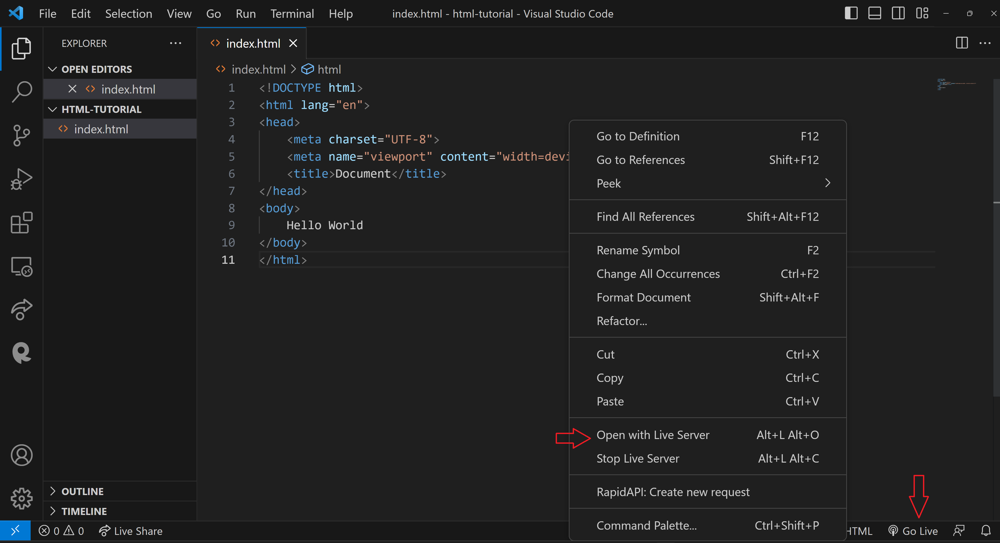
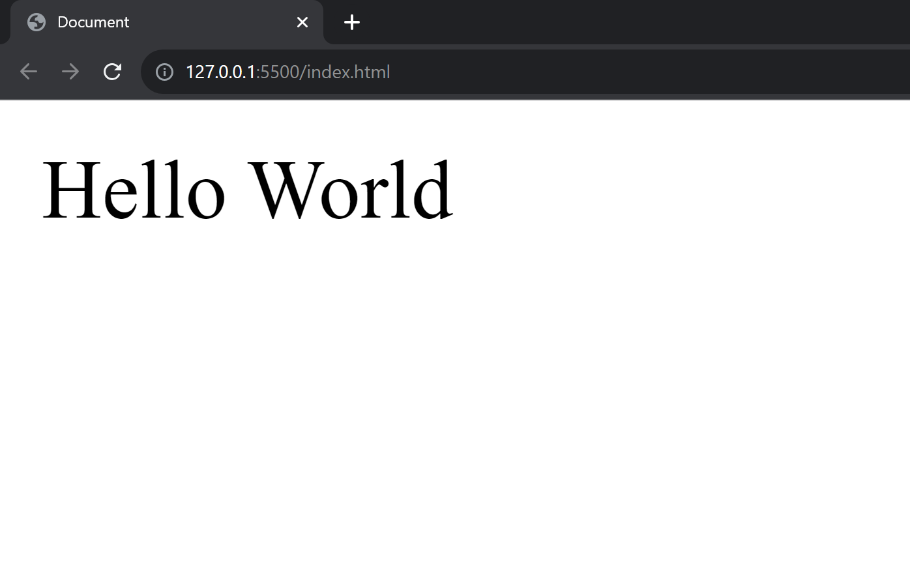
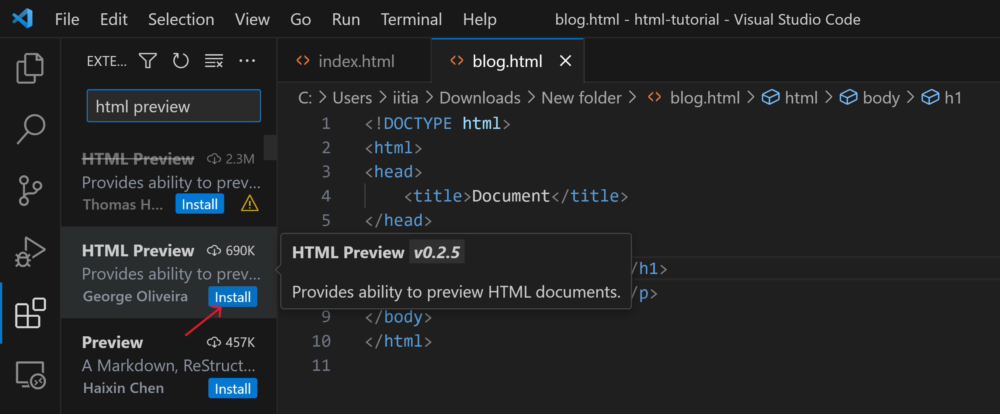
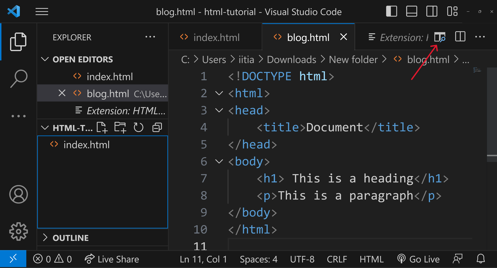
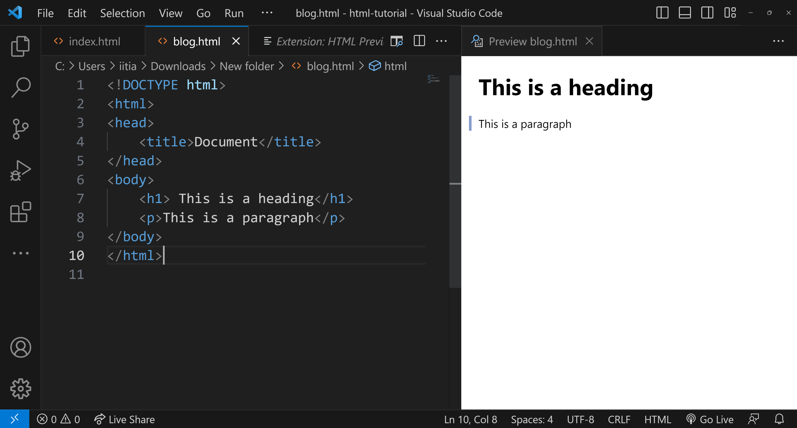

# Module 01.3: Execution - Your First "Hello World"

This is a major milestone in your journey. We are moving from setup to actually launching a website. In the programming world, it is a tradition to start with a "Hello World" program, and we are going to do exactly that with HTML.

---

## 1. Why "Hello, World!"?

"Hello, World!" is more than just text on a screen; it’s a tradition that dates back decades. It is the simplest way to test if your environment is set up correctly and to learn the basic syntax of a new language.

---

## 2. Setting Up Your Project Folder

Before writing code, you need a place to store it.

1. **Create a Folder:** On your computer, create a new folder (e.g., `html-tutorial`).
2. **Open in VS Code:** Open VS Code, click on **File > Open Folder**, and select the folder you just created.
3. **Create the File:** Click the **"New File"** icon (or press `Ctrl+N`) and name it `index.html`.
* *Note: Always use the `.html` extension so the browser knows how to read it.*

---

## 4. The "Boilerplate" Structure

Every HTML file requires a standard set of instructions to work correctly. In modern editors like **VS Code**, you don't have to type this manually.

### The Shortcut 

Simply type `!` and press **Enter** or **Tab**. This will automatically generate the "Boilerplate" code for you.

### The Code Breakdown

```html
<!DOCTYPE html>
<html lang="en">
<head>
    <meta charset="UTF-8">
    <meta name="viewport" content="width=device-width, initial-scale=1.0">
    <title>My First Web Page</title>
</head>
<body>

</body>
</html>

```

 **`<!DOCTYPE html>`:** This tells the browser, "I am using the latest version of HTML (HTML5)." Without this, the browser might use "Quirks Mode" and display your site incorrectly.

**`<html lang="en">`:** The root element. The lang attribute helps search engines (SEO) and screen readers know the language of the site.

 **`<head>`:** This is the "Brain" of the page. It contains metadata (info about the page) that the user doesn't see, like the title or character encoding (UTF-8).

 **`<body>`:** This is the "Heart" of the page. Everything written here is what the user actually sees on their screen.

---


## 3. Writing the Code
 
Now you have generated the boiler plate and understood it thoroughly,

Now Write `Hello World` into the body section.

```html
<!DOCTYPE html>
<html lang="en">
<head>
    <meta charset="UTF-8">
    <meta name="viewport" content="width=device-width, initial-scale=1.0">
    <title>My First Website</title>
</head>
<body>
    Hello World
</body>
</html>

```

## 4. Going Live (Two Ways to See Your Work)

### Option A: Using the Live Server Extension

This is the professional way. It opens your site in a real browser and refreshes automatically when you save changes.

* Look at the **bottom-right corner** of VS Code.
* Click the **"Go Live"** button.



* Your default browser will automatically open and show your "Hello World" message.



---


### Option B: Using the HTML Preview Extension

If you want to stay inside VS Code without switching to a browser, you can use the **HTML Preview** extension.

1. Go to the **Extensions** tab and install **"HTML Preview"**.



---

2. Once installed, you will see a small "Preview" icon in the top-right corner of your editor.



---

3. Clicking this opens a split screen inside VS Code showing your rendered page instantly.



---

## 5. Success!

If you see the words "Hello World" on a white screen, **congratulations!** You have just successfully:

* Created an HTML document.
* Used a professional code editor.
* Launched a local development server.
* Rendered code into a human-readable website.

---
