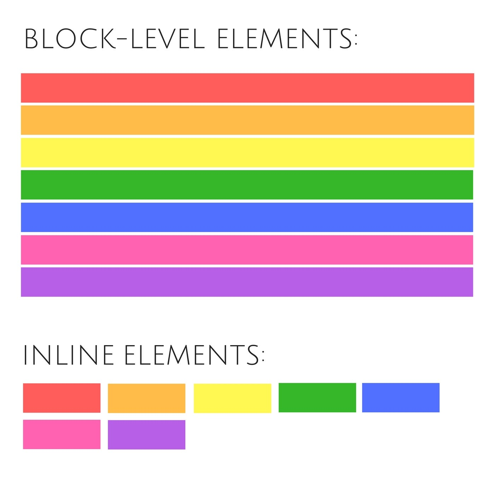

#  Module 01.10: Inline Elements

In HTML, elements are categorized based on how they sit on the page. While "Block-level" elements act like big boxes that take up the whole width, **Inline Elements** are like words in a sentence—they only take up exactly as much space as they need and stay on the same line.

---



## 1. What are Inline Elements?

Inline elements do not start on a new line. They fit snugly within the flow of other elements.

* **Width:** They only take up as much width as their content requires.
* **Flow:** They allow other elements to sit next to them on the same line.
* **Nesting Rule:** Inline elements can contain other inline elements (like putting `<strong>` inside a `<span>`), but they should **never** contain block-level elements (like putting a `<div>` inside a `<span>`).

---

## 2. Common Inline Elements

Here are some of the most frequently used inline tags that you will encounter:

* **`<span>`**: A generic container used to wrap text for styling.
* **`<a>`**: The anchor tag for links.
* **`<strong>`**: Makes text bold and signifies importance.
* **`<em>`**: Makes text italic for emphasis.
* **``**: Embeds an image (interestingly, images are inline-block by default).
* **`<input>`**: Creates an interactive field for users.

---

## 3. The Comprehensive List

Here is the exhaustive list of the most commonly used inline elements for your reference:

|  |  |  |  |
| --- | --- | --- | --- |
| `<a>` | `<abbr>` | `<acronym>` | `<button>` |
| `<br>` | `<big>` | `<bdo>` | `<b>` |
| `<cite>` | `<code>` | `<dfn>` | `<i>` |
| `<em>` | `` | `<input>` | `<kbd>` |
| `<label>` | `<map>` | `<object>` | `<output>` |
| `<tt>` | `<time>` | `<samp>` | `<script>` |
| `<select>` | `<small>` | `<span>` | `<strong>` |
| `<sub>` | `<sup>` | `<textarea>` |  |

---

## 4. Styling Notes

When you start using CSS, remember that inline elements behave differently:

* **Width & Height:** Setting a specific `width` or `height` usually **does not work** on a pure inline element.
* **Margins/Padding:** Top and bottom margins/padding may not push other elements away the same way they do for block elements.

---

##  Execution Code Snippet

Copy this into your `index.html` to see how inline elements stay together while block elements break to new lines:

```html
<!DOCTYPE html>
<html>
<head>
    <title>Inline Elements Practice</title>
</head>
<body>

    <h1>Inline vs. Block Demo</h1>
    
    <div>This is a Div (Block)</div>
    <div>This is another Div (Block)</div>

    <hr />

    <span>This is a Span (Inline).</span>
    <a href="#">This is a Link (Inline).</a>
    <strong>This is Strong (Inline).</strong>

    <p>
        In this paragraph, the <em>emphasized text</em> stays 
        right in the middle of the sentence because it is an inline element.
    </p>

</body>
</html>

```
---

<br>

# Block-level Elements

While inline elements fit like words in a sentence, **Block-level Elements** act like the bricks of a building. They are the structural containers that define the major sections of your webpage.

---

## 1. What are Block-level Elements?

A block-level element always starts on a **new line**, and the browsers automatically add some space (a margin) before and after the element.

* **Full Width:** By default, a block-level element stretches out to the left and right as far as it can, taking up the **full width** of its parent container.
* **The "Line Break" Effect:** Because they claim the entire horizontal row, any element that follows a block element will be pushed down to a new line.
* **Nesting:** Block-level elements are versatile; they can contain other block-level elements as well as inline elements.

---

## 2. Key Characteristics

If you want to build a layout, you need to understand these three rules:

1. **New Line:** They never sit side-by-side naturally (unless you use CSS Flexbox or Grid later).
2. **CSS Control:** Unlike inline elements, you can easily set a specific `width` and `height` for block elements using CSS.
3. **Container Nature:** They are used to group related content together (like a `<form>` wrapping several `<input>` tags).

---

## 3. Common Block-level Elements

Here is an exhaustive list of the most used block-level tags:

|  |  |  |  |
| --- | --- | --- | --- |
| `<div>` | `<p>` | `<h1>` - `<h6>` | `<article>` |
| `<section>` | `<header>` | `<footer>` | `<main>` |
| `<nav>` | `<ul>` | `<ol>` | `<li>` |
| `<form>` | `<table>` | `<blockquote>` | `<pre>` |
| `<hr>` | `<video>` | `<canvas>` | `<aside>` |
| `<figure>` | `<figcaption>` | `<address>` | `<fieldset>` |

---

##  Execution Code Snippet

Copy this into your `index.html` to see how block elements "stack" on top of each other, regardless of how short the text inside them is:

```html
<!DOCTYPE html>
<html>
<head>
    <title>Block Elements Practice</title>
    <style>
        /* Adding a background color so you can see the "Full Width" */
        .block-demo {
            background-color: lightblue;
            border: 1px solid blue;
            margin-bottom: 10px;
        }
    </style>
</head>
<body>

    <h1>Block-level Demonstration</h1>

    <div class="block-demo">I am a Block element (Div 1)</div>
    <div class="block-demo">I am another Block element (Div 2)</div>

    <p class="block-demo">I am a Paragraph, which is also a block element!</p>

    <section class="block-demo">
        <p>I am a paragraph inside a section (Block inside Block).</p>
        <span>I am a span (Inline) inside a section.</span>
    </section>

</body>
</html>

```
---

