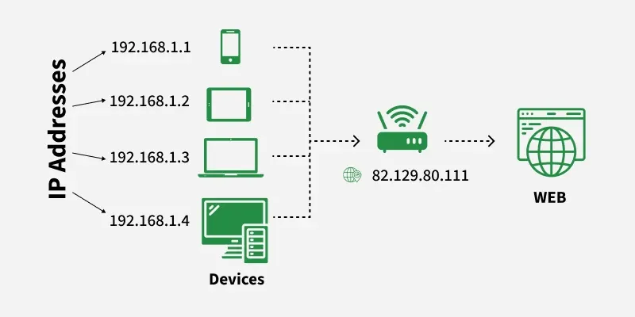
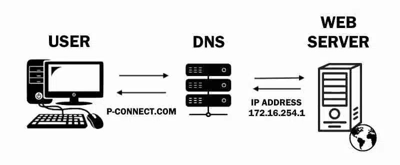
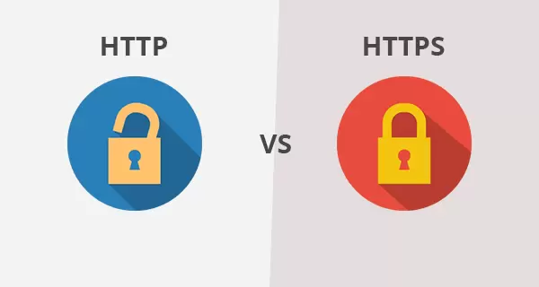
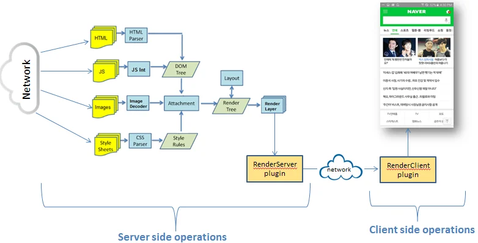

#  Module 00: How the Internet Actually Works

Before we touch any code, we need to understand the world our code lives in. If you don't understand the "plumbing" of the internet, you’ll struggle when things break. Here is the breakdown of what happens when you visit a website.

---

## 1. The Big Picture: Clients and Servers

The internet is basically just a huge conversation.

 **The Client:** This is you. Your phone, your laptop, or specifically, your **Browser** (Chrome, Firefox, etc.). The client is the one asking for things.
 **The Server:** This is a computer sitting somewhere else in the world that stays on 24/7. Its only job is to "serve" files (like HTML and CSS) when a client asks for them.

**The Process:** You ask for a page (Request) $\rightarrow$ The server sends the files (Response).

**lets Understand this with an Example;**

Imagine you are sitting at home and you want to see the latest Movie on **Netflix**. You type `Netflix.com` into your browser and hit Enter.

At that exact moment, your browser (the **Client**) creates a "Request" packet. It’s like writing a letter that says, *"Hey, I want to see the homepage of this site. Please send it to my IP address."*

---

## 2. IP Addresses: The Internet's Phone Numbers

Every device on the planet has a unique "address" so the internet knows where to send data.
Before that request can leave your house, the internet needs to know where to send it. The problem is, the internet doesn't understand "Netflix.com"—it only understands these look like numbers: `142.250.190.46`.

* Since humans can't remember numbers like that, we use **Domain Names** (like `google.com`).

### What is DNS?

The **DNS (Domain Name System)** is basically the internet's contact list. When you type a website name, your browser checks the DNS to find the real IP address of the server so it can connect to it.

This is where the **DNS** comes in. Think of it as your browser making a quick phone call to a giant digital phonebook:

**Browser:** "Hey DNS, what's the address for Netflix.com?"  
**DNS:** " Here it is 104.21.75.18."

Now your request has a destination.

---

## 3. HTTP and HTTPS: The Rules of the Road

When a browser and a server talk to each other this Web communication have to follow a set of rules called **HTTP (HyperText Transfer Protocol)**. However, for modern web development, the standard has shifted entirely to **HTTPS** **(HyperText Transfer Protocol Secure)** for security and privacy.

 **HTTP:** The standard way data is sent.
 **HTTPS:** The "S" stands for **Secure**. It means the data is encrypted. If you're building a site today, **always use HTTPS**. It keeps user data (like passwords) safe from people trying to spy on the connection.

 

### The Important Technical Walkthrough

* **HTTP (HyperText Transfer Protocol):** When a request is made via HTTP, the data is sent in **Plain Text**. If you send a password, it travels across the network exactly as you typed it. Anyone with access to the network nodes (like a public Wi-Fi admin or a malicious actor) can use "packet sniffing" tools to read your data.    
* **HTTPS (HyperText Transfer Protocol Secure):** This uses **TLS (Transport Layer Security)** to encrypt the communication. Before any data is sent, the browser and server perform a "Handshake" to exchange cryptographic keys. Once the connection is established, all data sent back and forth is encrypted. Even if someone intercepts the data, they only see an unreadable string of characters.

### How to Implement HTTPS in your Projects

As a developer, you don't "code" HTTPS into your HTML. It is a server-level configuration. Here is how you use it:

1. **Obtain an SSL/TLS Certificate:** You need a digital certificate issued by a Certificate Authority (CA).
* **Recommendation:** Use **Let's Encrypt** (it is free and industry-standard).

2. **Deployment:**
* If you use platforms like **Vercel, Netlify, or GitHub Pages**, HTTPS is enabled by default the moment you deploy your site.
* If you are managing your own Linux server (VPS), you would use a tool like **Certbot** to automatically fetch and renew your certificates.

3. **HSTS (HTTP Strict Transport Security):** To ensure maximum security, you should configure your server to automatically redirect all `http://` requests to `https://`. This ensures that even if a user types the address manually without the "s", they are pushed to the secure version.

### Why HTTPS is Mandatory

* **Data Integrity:** It prevents "injection" attacks where a middleman could modify your website's code before it reaches the user.
* **SEO:** Google and other search engines penalize sites that do not use HTTPS.
* **Browser Trust:** Modern browsers (Chrome, Edge, etc.) will display a "Not Secure" warning to users if your site lacks a valid certificate, which destroys user trust.
---

## 4. Packets: How Data Moves

Your request is now traveling through your router, into the fiber-optic cables under your street, and maybe even across an ocean through undersea cables.

But it’s not traveling as one big file. Your request is broken into tiny Packets. If one cable is crowded, some packets might take a different route through a different city, but they all eventually find their way to the Server (the big computer holding Netflix's website files).

Imagine sending a puzzle to a friend. Instead of sending it assembled, you put each piece in a separate envelope. These packets might travel different paths across the world, but they all eventually meet back up at your computer, where your browser snaps them back together in the right order.

---

## 5. The "Response" (The Server Answers) Status Codes:

When you type **youtube.com** in the browser, it first finds the **IP address** of the domain, because communication over the internet happens via IP addresses. The browser asks **DNS (Domain Name System)** to convert the domain name into an IP address.

Once the IP is found, the browser sends an **HTTP request** to the server asking for the page’s resources. The server responds with **HTML, CSS, JavaScript, and images**. The browser then parses and executes these files to **render the web page**.

So, even though the user types a domain name, the actual communication happens using **IP addresses and HTTP requests**.

The Server then sends a Response back to you. Along with the files, it sends a Status Code.

If everything is fine, it sends a 200 OK.

If you typed the URL wrong, it sends back a 404 Not Found (which is basically the server saying, "I looked, but I don't have that file!").

* **200 OK:** Everything worked perfectly.
* **301 Moved:** The page has a new home.
* **404 Not Found:** You asked for something that doesn't exist (most common error).
* **500 Server Error:** The server crashed or has a bug in its code.

---

## 6. How the Browser Shows the Page (Rendering)

Once your browser gets the HTML, CSS, and JS files, it doesn't just show the text. It "Renders" it.

1. It reads the **HTML** to see what content is there (text, images).
2. It looks at the **CSS** to see how it should look (colors, fonts).
3. It runs the **JavaScript** to make things interactive (buttons, animations).

---

## 7. Cache A Local Storage.

A **cache** is a temporary storage where a system keeps copies of frequently used data so it can be accessed faster later. In web browsing, when you open a website, the server sends files like **HTML, CSS, JavaScript, and images**. The browser may store some of these files in its cache. If you visit the same page again, the browser can load those files from the **local cache instead of requesting them again from the server**, which makes the page load faster and reduces unnecessary network requests.
